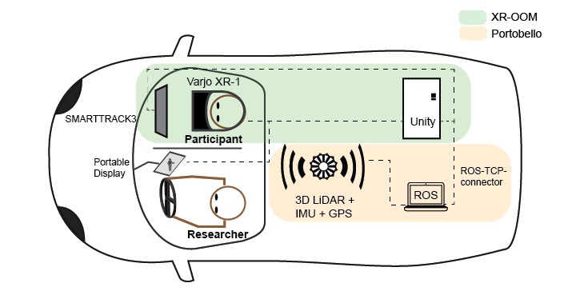
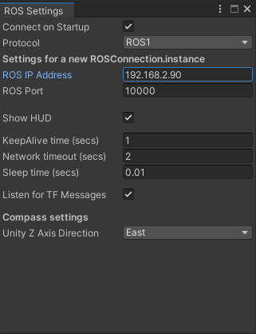

### Portobello

Portobello is an infrastructure system that enables study portability in driving simulation studies. It consisted of several key components that rely on open-sourced hardware.



---

#### Hardware Setup
Only core equipment is listed.
- LiDAR (Ouster-64)
- IMU (Some LiDAR comes with a built-in IMU, but if not, an external IMU is required, we had Xsens MTi 300)
- Laptop (Ubuntu 20.04, running ROS)
- Desktop (Windows, running Unity)
- Ethernet Switch 
- Mobile Router

Mobile Router is required to assign IP address for devices, including LiDAR, desktop running Unity, and the laptop running ROS. 
 
---

#### Software Setup
- Robot Operating System (ROS 1 Noetic)
- Unity


#### Mapping
To generate a map of the study area, we used SLAM algorithms to generate a digital twin pointcloud. The algorithm we used was [LIO-SAM](https://github.com/TixiaoShan/LIO-SAM) by [Tianxiao Shan](https://github.com/TixiaoShan), but there are many alternatives online. Users should choose based on their system and available sensors. 

In this repository, I attached a version of LIO-SAM that can be compiled with ROS 1 Noetic. Adjustments are made based on this [link](https://github.com/TixiaoShan/LIO-SAM/issues/206#issuecomment-784684341).

To visualize point cloud in Unity for event staging, we recommend the [pcx](https://github.com/keijiro/Pcx) shader made by [Keijiro Takahashi](https://github.com/keijiro). If you are using HDRP, checkout this [repo](https://github.com/yumayanagisawa/Unity-Point-Cloud-VFX-Graph). Since the shader plugin only works with PLY format files, I figured out a pipeline to convert ROS generated pcd files to PLY format.

1. Open the pcd file in Blender via this nice [plugin](https://markhedleyjones.com/projects/blender-pcd-io) made by [Mark Hedley Jones](https://markhedleyjones.com/).
2. Save the file as Wavefront obj. (You cannot save directly as PLY here since there are no faces.)
3. Open the obj file in [MeshLab](https://www.meshlab.net/)
4. Save again as PLY file.


#### Localization
At runtime, to localize the vehicle's position in the pointcloud, we used [hdl_localization](https://github.com/koide3/hdl_localization). The key is to have a tf transform from the `/map` frame to `/base_link` frame or `/lidar_link` frame.

#### Connecting with Unity
To connect ROS tf tree with Unity, [Unity-Robotics-Hub](https://github.com/Unity-Technologies/Unity-Robotics-Hub) provides a bridge between the two worlds. Specifically, we used the [ROS-TCP-IP](https://github.com/Unity-Technologies/ROS-TCP-Connector) package to broadcast tf tree to Unity. Frames in tf trees will show up as transforms in Unity object hierarchy.

```
roslaunch ros_tcp_endpoint endpoint.launch tcp_ip:=[IP FOR THE LAPTOP RUNNING ROS]
```

In Unity, the ROS setting should match with ROS version on the laptop and IP address (also port if necessary).


#### Attaching Gameobjects to Real-World Object
Since the LiDAR's real world position is available in Unity as transforms, users can attach objects to these transforms as children, or keep a history of the past coordinates for smoothing.

The tf tree will be represented as a seperate hierarchy. For example, to represent the `map -> base_link` tf tree, `base_link` will be shown as a child of map in the hierarchy. To access vehicle's real time position in C# (assuming `base_link` is provided in the ROS software stack),

```
base_link_pos = GameObject.Find("map/base_link");
```

#### Contact
For any questions, please email Frank at [fb266@cornell.edu](mailto:fb266@cornell.edu).
